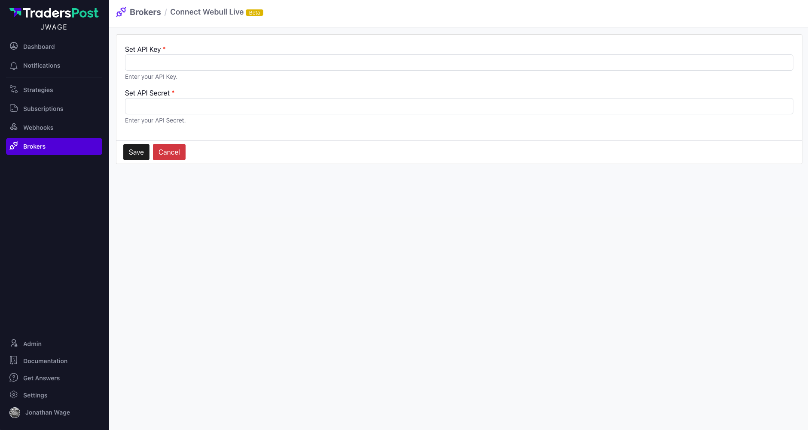

# Webull


COMING SOON. Join the [wait list](https://traderspost.io/broker/webull) to be notified once Webull is available.


## Contact Information

Email: [customerservices@webull.us](mailto:customerservices@webull.us)

Phone: [+1 (888) 828-0618](tel:18888280618)

## Supported Asset Classes

* Stocks

## Market Data

Webull does not yet provide access to market data through their API, so the we use market data from [Polygon](https://polygon.io/) at no additional charge to you.

## Authentication

Webull accounts can be connected to TradersPost manually by getting an access token from Webull. Unfortunately, Webull has not yet implemented OAuth with refresh tokens so you will need to manually do this and when the token expires, you will have to repeat the manual steps again to reconnect Webull to TradersPost.

To get started, first go to [Webull.com](https://webull.com) and login. Once logged in, click your profile icon at the top right and then click **My Account** from the menu.

<figure><figcaption>
Webull.com homepage
</figcaption></figure>

Now click **API Management** in the left menu and then click **Register an API Application**.

<figure><figcaption>
Webull API Management
</figcaption></figure>


If the **API Management** link is missing from the left menu, please contact Webull support at [api@webull.com](mailto:api@webull.com) to enable it for you. It is not activated by default.


Follow the steps to register your API application and afterwards you should land on a screen like this. Click **Revise** and change the expiry date from 1 day to 7 days.

<figure><figcaption>
Webull API Management
</figcaption></figure>

Change the **App Secret Expiry Date** from `1d` to `7d`.

<figure><figcaption></figcaption></figure>

Now click **Generate Key** and follow the steps to generate an API key. Copy this information and store it somewhere secure in a password manager like 1password.

Once you have your API Key and Secret, head over to TradersPost and click **Brokers**, then click **Connect Live**, choose **Webull** from the list of available brokers, paste your api key and secret in the form and click Save.

<figure><figcaption>
TradersPost Connect Webull
</figcaption></figure>
