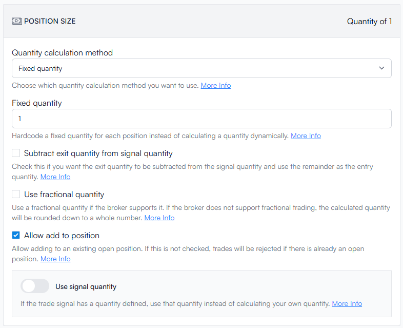

# Prop Firm Trading

TradersPost connects your [TradingView](tradingview.md) or [TrendSpider](trend-spider.md) alerts to [NinjaTrader](../core-concepts/brokers/ninjatrader.md)/[Tradovate](../core-concepts/brokers/broker-roadmap/tradovate.md), letting you execute manual or automated futures trades in one, or dozens, of proprietary‑firm evaluation (eval) and funded accounts simultaneously. TradersPost handles the order routing, position sizing, and account‑level risk parameters so you can focus on strategy, not button clicking.


Before linking TradersPost to any proprietary trading firm, you must verify that your trading approach complies with that firm’s rules and restrictions. TradersPost does not approve or encourage the use of our platform to circumvent, breach, or otherwise violate a prop firm's terms and conditions. You are solely responsible for understanding, following, and staying up to date with each firm's policies. Failure to do so may result in penalties or account termination imposed by the prop firm and/or suspension of your TradersPost integration. TradersPost accepts no liability for any consequences arising from non‑compliance.

Prop firms differ in what they allow for automation, scaling, and risk. Always confirm that your strategy and order flow comply with each firm's terms. TradersPost offers the tools, but you remain responsible for rule adherence.


## Supported Prop Firms

As of May 2025, the list of supported prop firms includes:

* [Alpha Ticks](https://app.alpha-futures.com/signup/Jonathan002558/)
* [Alpha Trader](https://alphatraderfirm.com/ref/1048/)
* [Apex Trader Funding](https://apextraderfunding.com/)
* [BluSky Trading](https://blusky.pro/?ref=mzizogz)
* [Blue Guardian](https://checkout.blueguardian.com/ref/72242/)
* [E8X](https://e8markets.com/a/traderspost)
* [Elite Trader Funding](https://elitetraderfunding.com/?ref=jwage)
* [Funded Futures Family](https://www.fundedfuturesfamily.com/)
* [Funding Futures](https://fundingfutures.com/)
* [Futures Elite](https://app.futureselite.com/auth/sign-up?code=AFF1174182)
* [Fxify Futures](https://app.fxifyfutures.com/?ref=CiBnOOFcHOxu)
* [GOAT Funded](https://checkout.goatfundedfutures.com/aff/239/)
* [Legends Trading](https://app.thelegendstrading.com/plans/ref/294/)
* [My Funded Futures](https://myfundedfutures.com/)
* [Purdia Capital](https://purdia.com/?i=TRADERSPOST)
* [Take Profit Trader](https://takeprofittrader.com/)
* [The Futures Desk](https://www.thefuturesdesk.com/)
* [TickTickTrader](https://tickticktrader.com/)
* [TopOneFutures](https://toponefutures.com/?linkId=lp_707970\&sourceId=traderspost\&tenantId=toponefutures)
* [Topstep](https://www.topstep.com/)
* [TradeDay](https://members.tradeday.com/membership-plans-pricing?a_aid=traderspost)
* [Tradeify](https://tradeify.co/)
* [TX3Funding](https://tx3funding.tech/checkout/ref/27/?add-to-cart=1495)

## Managing Multiple Prop Firm Accounts via Tradovate



### Tradovate Access Token Limits and the Parent Account Solution

Think of an access token as a one-time digital "key" that lets a platform (like TradersPost) open the door to your Tradovate account or accounts.

Prior to May 23, 2025, each time you connected a Tradovate account with the same login, we asked for a brand-new key. If you had 20 accounts, it was like asking for 20 different keys for the same door.

Tradovate has a limit to how many access tokens you can use at any one time. If you connect Tradovate over and over through TradersPost, you'll eventually hit this limit with 15+ accounts.&#x20;

So, the solution is to use one "Parent" account and share that access token with all the accounts through that login. This will also make it easier to delete accounts that have passed or failed the eval stage without affecting all the other connections.

### Start with a Parent Account

<figure><figcaption></figcaption></figure>

The Goal:

1. To get a single account connection that has no Primary Broker above it that we name as a Parent Account. This connection won't count against your plan limit.
2. It will have no paper account selected.
3. All your individual prop firm accounts will be listed as Sub Accounts.

The Steps:

1. Once you have turned a new or existing broker connection (under a single prop firm login) into a Parent Account, the next step is to ensure all the other broker connections show Primary Broker as the parent account.
2. This can be done by deleting all the existing connections and starting over. Each time you add a broker account with the same prop firm login, we'll reuse the connection from the Parent Account. Or you can clone that Parent Account connection under Brokers > Inactive Brokers > Choosing the Parent Account > Clicking the three-dot menu > Clicking Clone.

<figure><figcaption></figcaption></figure>
